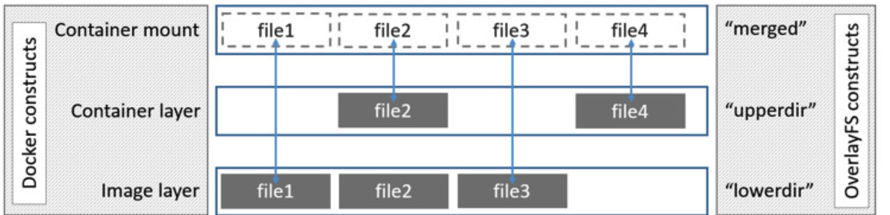
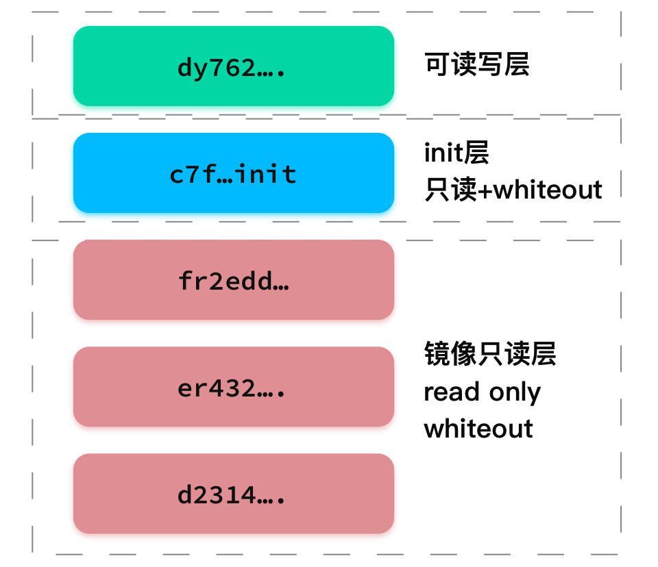

# 理解容器镜像
相信看完了前面的几篇支线分享，你对容器就是个进程的概念有了一定的理解。也应当明白了Linux Namespace技术为容器进程施加了“障眼法”，使得容器看不见其他进程，看不到其他网卡。而Cgroups技术为容器进程画了个”圈”，使得它不能超额使用资源。
那不知道，你有没有想过这些问题呢:

- 容器进程所看到的文件，为什么会是镜像里面的文件？
- 容器进程内对内部文件进行了修改，为什么依赖这个镜像的其他容器没有受到影响？
- 容器进程内对一个文件进行了删除，commit后得到的信镜像，大小为啥没有变化？
- 有经历过，读取镜像中大文件时，监控面板突然飙高的io延迟吗？
## 挂载与Mount Namespace
如果你理解了前面的文章，其实应该可以想到Mount Namespace。通过这个Namespace来限制容器进程的文件系统。
```c
#define _GNU_SOURCE
#include <sys/mount.h>
#include <sys/types.h>
#include <sys/wait.h>
#include <stdio.h>
#include <errno.h>
#include <sched.h>
#include <signal.h>
#include <unistd.h>
#define STACK_SIZE (1024 * 1024)
static char container_stack[STACK_SIZE];
char *const container_args[] = {
    "/bin/bash",
    NULL,
};

int container_main(void *arg){
    printf("hello container world!\n");
    // 避免shared的根mount，会继承到子mount ns。
    // 如果继承了，那么在子ns中的更改会影响根ns的文件系统。
    mount("", "/", NULL, MS_PRIVATE, "");
    // 重新挂载test-mount,将其挂载为tmpfs内存
    mount("none", "/test-mount", "tmpfs", 0, "");
    // 执行/bin/bash
    execv(container_args[0], container_args);
    printf("err: %s\n", errno);
    return 1;
}

int main(){
    printf("start a container with a mount namepsace!\n");
    // 创建一个"容器"进程.
    // container_main => 进程执行container_main这个函数
    //  container_stack + STACK_SIZE => 使用的堆栈
    // CLONE_NEWNS | SIGCHLD => 开启新的mount namespace，
    // 并且注册CHLD信号，子进程退出通知父进程
    int container_pid = clone(container_main, container_stack + STACK_SIZE,
                              CLONE_NEWNS | SIGCHLD, NULL);
    // 等待子进程执行完毕
    waitpid(container_pid, NULL, 0);
    printf("bye container!\n");
    return 0;
}
```

上面这段C代码就是创建进程的时候传入了`CLONE_NEWNS`来指定进程使用新的mount namespace。但细心的你应该发现了，在容器开始执行bash之前，有mount操作。这也是mount namespace 与其他namespace不同的地方。它需要mount操作之后，才会真正的生效。
我们来测试下这段程序（基于Linux系统）：
```bash
root@linux$: mkdir /test-mount
root@linux$: echo a > /test-mount/test.log
root@linux$: gcc ./mount.c -o container-mount-ns
root@linux$: ./container-mount-ns
root@container$: ls /test-mount
root@container$: exit
root@linux$: ls /test-mount
test.log
```
会看到我们在机器上创建的`test.log`文件在容器内看不见了。退出容器后，发现`test.log`依然存在于机器上，这就是mount namespace的魔力。

!!! tips 
    不要小看上面几行系统调用，这是Linux社区努力后的结果。而用GO语言实现的docker项目，为了在有协程语义的go语言中实现clone，采用了非常Linux，非常Golang风格的实现方式。后续与机会再与大家分享，感兴趣的同学，可以点击参考链接自己研究下。[参考链接](https://github.com/moby/moby/tree/master/pkg/reexec)（可以从init的执行顺序与linux中/proc下进程文件的链接入手）

## 镜像-应用的静态诉求
其实基于上面的例子，相信你应该可以大致明白mount namespace对于容器进程的意义了，它可以为容器进程准备一套新的文件系统，进程在里面进行的mount操作，文件操作，不会影响外部的文件系统。在docker的实现中，并不是使用mount，而是pivot_root系统调用或者chroot。其实三者的目的是一致的，都是要切换容器的文件系统。在例子中，我们只改变了`/test-mount`这个文件的挂载，容器项目改变的则是容器进程的`/`目录，将其挂载为镜像中的文件与目录，而这种提供`/`目录的文件，其实有个专业的名字叫rootfs（根文件系统）。

一个基本的rootfs大致会提供一下这些文件：
```bash
root@linux$: ls /
bin dev etc home lib lib64 mnt opt proc root run sbin sys tmp usr var
```

!!! 小贴士 
    rootfs仅仅只是文件系统，它只包含系统的文件与目录结构，而不包含linux的内核。linux项目分离了静态的文件与runtime的内核，内核只有在启动时，才会被加载。这种分离并且模块化，带来的好处便是可维护性的增加。
    而正是因为rootfs不包括内核，也就造成了所有容器进程都会依赖，共享宿主机的内核。

一直以来，程序的依赖管理都是程序开发中的痛点，无论是java的maven，rust的cargo和go的moudle，都是致力于提供依赖管理的功能。而在程序编译成二进制准备部署时,这种依赖便变成了`程序对运行环境的依赖`,甚至在某些特殊场景下，这种依赖可能是`程序对操作系统的依赖`。你会发现，想在"陌生"的环境上，运行一个程序要经历重重考验。如果是合作开发部署，最后可能还会得到一句"我程序没问题，是你环境有问题。要不你换个系统吧"。

镜像的存在，解决了这些问题，因为镜像中包含的不仅仅是应用程序，还有整个系统的文件系统，这是一个程序运行所依赖的最完整的"库"。镜像这种"打包操作系统的能力"，不仅强大，还带来了一个"强一致"的好处。不论你在哪里，pc，服务器，云主机，虚拟机。只要你的架构与镜像支持的架构相同，那么你就可以跑起来这个镜像中的程序。这种一致性，打破了开发与运维之间的屏障，使得软件交付变得便捷，透明。

镜像保存了程序依赖的所有库，在没有运行的时候，就安静的作为静态文件待在磁盘上，而一旦用`docker run`命令启动了镜像后，镜像就会变为容器进程的文件系统，将程序需要的库全部准备好，同时承担着容器进程的所有文件操作。可以说，正是因为有了镜像，应用程序才有了一个可以保存从操作系统到上层程序依赖的地方。
## 分层-Docker项目的一小步，容器圈子的一大步
有没有想过，如果docker不支持FROM base images这个功能，会是怎样的场景？其他同事打好了一个GRPC的镜像，然后在里面安装了一些程序的依赖，而你也想用GRPC，但是直接用同事的镜像有版本冲突的问题，这个时候你不得不重新构建一套新的rootfs。

还好，Docker项目支持FROM这个功能，使得我们可以轻松引用别人的基础镜像，站在巨人的肩膀上，构建我们的程序。甚至，docker还迈出了一小步，它并没有采用原始的rootfs的打包方式，将所有的文件与目录保存为一个压缩包。

它做了创新，引入了`layer`层的概念。制作镜像的每一步，都会是新的一层。具体一点就是，你在Dockerfile里面的每一步，都会是Base镜像的增量rootfs。docker run的时候，将所有层通过联合文件系统（Union File System）挂载为一个统一文件视图，展示给容器进程。当然，你应该也能想到，这也是Linux支持的功能，你看，容器虽然新，但他用的技术其实都是Linux已经存在的技术。

docker在Linux上一般采用的都是Overlay2作为联合文件系统的后端。
联合文件系统也好理解，它的具体含义就是将不同的目录，合并挂载到同一个目录下。
```bash
root@linux$: mkdir {a,b,c}
root@linux$: echo "a" > a/{a.log,x.log}
root@linux$: echo "b" > b/{b1.log,b2.log,x.log}
root@linux$: mount -t overlay c -o lowerdir=./a:./b ./c
root@linux$: ls c
a.log  b1.log  b2.log  x.log
```
上面的命令，先是创建了3个目录a,b,c。然后在a目录里创建了a.log与x.log两个文件,在b目录里面创建了b1.log,b2.log,x.log三个文件。最后通过mount命令将a,b联合挂载到c目录下。查看c目录下的文件，会发现a,b两个目录下的文件都在c中了。这就是联合文件系统。
!!! 思考
    你是否好奇，a,b中都有的x文件，为啥只在c中看到了一份呢？它们是合并了，还是其中一个覆盖了另一个？自己动手cat x.log试试看。

体会过overlay挂载后，咱们来看看docker是如何使用联合文件系统的。
```bash
root@linux$: docker images
REPOSITORY                                TAG                  IMAGE ID       CREATED         SIZE
192.168.100.21:5000/vipower               latest               d27d26e893ac   3 days ago      22.8MB
docker inspect d27d26e893ac |grep Layers -A 5
"Layers": [
    "sha256:77cae8ab23bf486355d1b3191259705374f4a11d483b24964d2f729dd8c076a0",
    "sha256:806a69d1d511735d6f7dd0a737cff0aae638b68a4c6bcc8eb5605a1c1958fcfe"
    ]
},
"Metadata": {
```
我们用`docker inspect`这个命令来获取这个镜像的详细信息，同时`grep Layers`查看它的分层信息。可以看到这个这个镜像有两层的，那么在`docker run`的时候，docker就会把这两层，利用联合文件系统挂载成为容器进程的根文件系统。
我们来看看run之后，看看机器上的overlay挂载的情况
```bash
root@linux$: docker run d27d26e893ac
root@linux$: mount -t overlay
```
如果你的机器上跑了多个容器进程，你会看到大量的overlay挂载，不方便定位到刚起的容器的文件系统。我们来用下面的方法试试看
```bash
root@linux$: docker inspect 2880dc11c8dd |grep -i data -A 2  #2880dc11c8dd为容器的id
"Data": {
    "LowerDir": "/var/lib/docker/overlay2/c7f54c273b662496491c051ea0c1f12a62aae7251c5282a5af888625bdf8a5ee-init/diff:/var/lib/docker/overlay2/5eb2c45a6fe3ee7a9b1d57e36e505c12f1abe520de5dde704471eb6dd0db1753/diff:/var/lib/docker/overlay2/32bd98dadeabfdf4dc0df8ed8c0a6d769a56f18bb2b6e7ef0a09cb788deee576/diff:/var/lib/docker/overlay2/f03cd434040fff26e9693f34611555ec563eea3332ff3894e47093816dc0516b/diff:/var/lib/docker/overlay2/d520a419405781b13e2a41039f3508e62eed99687b5610397f9372f4a69162f6/diff:/var/lib/docker/overlay2/67d02ab0a0fe4f952ee876833b00aade361050dfe29e876ae4ae0b9dc756c708/diff:/var/lib/docker/overlay2/98567e3411a721249711b7c031b2281f8bfa0011319d8ef25c758aef374d5c88/diff:/var/lib/docker/overlay2/6fc1319b77a980c3646389764b313f9b7416c1a32d666257d38b865cd0f94435/diff",
    "MergedDir": "/var/lib/docker/overlay2/c7f54c273b662496491c051ea0c1f12a62aae7251c5282a5af888625bdf8a5ee/merged",
```
其实这些`lowerdir`这就是容器的文件系统在磁盘上的位置。至于`lowerDir`和`mergedDir`这些新单词，其实是overlay的两个术语。OverlayFS将较低的目录称作`lowerdir`,将较高的目录称作`upperdir`,将展示的统一文件视图称作`mergeddir`。其实在使用OverlayFs时，不会以`高`,`低`来区分，而是以`读写`来区分的，`lowerdir`只读，`upperdir`可读可写。了解了这些我们来看看docker是如何使用OverlayFS的：

从图中不难看出，docker项目把镜像作为lowerdir，也就是只读层。而在容器运行时，会创建一个目录，作为upperdir，也就是读写层。最后将这两层dir合并挂载为merged目录展示给容器进程。其实，从图中也能看出，2层目录中都有的file2，会用upperdir中的file2覆盖lowerdir中的，其实这是OverlayFS的一个特性。在Overlay2中，两层中有重名的文件，都会用上层文件覆盖下层文件。

你可能注意到了docker把镜像当做`lowerDir`,这层在OverlayFS中是只读层啊，可是我明明可以在容器进程内修改镜像中的文件啊。
这其实利用到了大名鼎鼎的”Copy-on-Write“思想，当你要修改只读层的文件时，OverlayFS会先将文件从只读层拷贝到读写层，在进行修改。当然了这种拷贝只发生在对该文件第一次修改的时候，后续的修改都会对这个在读写层的副本文件进行操作。这其实也就解释了为什么修改镜像中的文件不影响其他使用该镜像的容器和读取镜像中大文件时，io延迟会增加的问题。

在容器中，修改文件可以使用"Copy-on-Write",那我如果我在容器进程里删除了镜像中的文件，会发生什么呢？lowerDir是只读的，我们没办法对他就行除了读完的所有操作，那么该怎么进行删除呢？其实这个删除也不是真正的删除了，而是在容器的upperdir中创建了一个`whiteout`文件，和这个文件同名的文件就会被盖住，不会显示在文件系统里。（OverlayF利用了linux中的c类型的字符设备，有兴趣的可以研究下）。
我们来试试在容器中删除下镜像中的文件
```bash
root@linux$: docker run -it --rm --entrypoint sh 192.168.100.21:5000/vipower:latest
/: ls -lh
drwxrwxrwt    2 root     root           6 Oct 21  2019 tmp
drwxr-xr-x    7 root     root          66 Oct 21  2019 usr
drwxr-xr-x   11 root     root         125 Oct 21  2019 var
-rwxr-xr-x    1 root     root       16.4M Jan 18 08:24 vipower
root@linux$: rm -f vipower
```
咱们在另一个终端里把这个容器提交下
```bash
root@linux$: docker ps
ccae1dcc2385   192.168.100.21:5000/vipower:latest                           "sh"                     2 minutes ago   Up 2 minutes                                      
root@linux$: docker commit ccae1dcc2385 192.168.100.21:5000/vipower:delete
root@linux$: docker images
REPOSITORY                                TAG                  IMAGE ID       CREATED          SIZE
192.168.100.21:5000/vipower               delete               1508a8cee3bc   25 seconds ago   22.8MB
192.168.100.21:5000/vipower               latest               d27d26e893ac   4 days ago       22.8MB
```
咦，我们在镜像中删除了14M大小的vipower，提交后得到的镜像大小居然没有变化！其实这就是`whiteout`文件的魔力。

咱们来总结下OverlayFS的功能与特点，首先它是一个联合文件系统，可以把不同的目录，合并挂载到一个目录下，它是两层的文件系统上层读写，下层只读，同名的上层文件会覆盖下层的，修改下层文件会使用"copy-on-write",删除下层文件会使用“whiteout”文件来使文件系统不显示该文件。

总结完OverlayFS的特点，我们来实际看看Docker的镜像哲学，回到上面的这条命令
```bash
root@linux$: docker inspect 2880dc11c8dd |grep -i data -A 4  #2880dc11c8dd为容器的id
"Data": {
    "LowerDir": "/var/lib/docker/overlay2/c7f54c273b662496491c051ea0c1f12a62aae7251c5282a5af888625bdf8a5ee-init/diff:/var/lib/docker/overlay2/5eb2c45a6fe3ee7a9b1d57e36e505c12f1abe520de5dde704471eb6dd0db1753/diff"
    "MergedDir": "/var/lib/docker/overlay2/c7f54c273b662496491c051ea0c1f12a62aae7251c5282a5af888625bdf8a5ee/merged",
    "UpperDir": "/var/lib/docker/overlay2/c7f54c273b662496491c051ea0c1f12a62aae7251c5282a5af888625bdf8a5ee/diff",
    "WorkDir": "/var/lib/docker/overlay2/c7f54c273b662496491c051ea0c1f12a62aae7251c5282a5af888625bdf8a5ee/work"
```
可以看到除了之前介绍的"lowerdir"和"upperdir",还有提供统一视图的"MergedDir",而"WorkDir"其实是用于COW涉及原子操作时的目录，你若是感情兴趣可以去看看Linux内核[文档](https://www.kernel.org/doc/html/latest/filesystems/overlayfs.html)。而每个目录后面的"/diff"其实是docker项目的文件结构，"diff"目录会存放本层所有的文件。

!!! tips
    OverlayFS是第一个合并入Linux内核主干的联合文件系统，在它没有合入内核前，docker在发行版采用的FS不同，例如在Ubuntu中使用过Aufs,关于Aufs与OverlayFS的差别，你可以自己搜索下资料，期待着你的分享。[Docker项目Storage Driver](https://docs.docker.com/storage/storagedriver/select-storage-driver/)

不知道，细心的你发现了一个细节没有，在LowerDir的目录中的第一个目录后面跟了`-init`。这其实也是docker项目的一个概念。他介于镜像的只读层与容器运行时的可读写层之间，大致如下：


可读写层与只读层上面已经介绍过了，而这个新出现的init层，其实是docker项目为一些特殊文件准备的，例如"/etc/hosts","/etc/hostname","/etc/resolv.conf"等文件，这些文件有个特点，就是这些文件可能只想对当前容器生效，不想在commit后，存在于镜像中，从而影响其他使用该镜像的容器，所以docker项目多加了一个init层，docker commit的时候只会提交可读写层的变化，而不会提交init层的变化。

!!! info 
    如果你想对init层有更多的了解，可以参照这个[链接](https://github.com/moby/moby/blob/b865beba22aac576b95952fef97d4e775632c362/daemon/initlayer/setup_unix.go#L20)
## 思考
这篇文章中和大家一起分享了关于容器文件系统的实现方式。不难看出这种容器的文件系统其实就是我们平常一直所说的"镜像"。而Docker项目创新的引入分层的概念，一来解决了曾经虚拟机整个操作系统的磁盘镜像动辄上G的大小，二来因为共享层的存在，使得镜像需要的总空间，远小于镜像大小的总和。基于这两点，使得开发人员之间的协作变得敏捷了起来。而打包整个”操作系统“的这个能力，使得镜像具有了一致性，无论何时何地，你pull了这个镜像，得到了内容就会是一模一样的，而这个一致性，使得部署变得简单了起来。

看过这篇文章，不知道你对下面的问题，有怎样的见解？

- 容器采用的写时复制策略（COW）会有"坑"吗 ？（可以考虑在先读后写同一个文件的场景下，如果我比较了2次文件的checksum，会有怎样的结果）

!!! tips 
    如果你想复现这个场景，可以找一个老版本的centos6的镜像，执行以下yum看看
## 参考链接与推荐阅读
[Linux: OverlayFS](https://www.kernel.org/doc/html/latest/filesystems/overlayfs.html)

[Docker: Use the OverlayFS storage driver](https://docs.docker.com/storage/storagedriver/overlayfs-driver/)

[Docker: Storage Driver](https://docs.docker.com/storage/storagedriver/select-storage-driver/)

[Docker: Init Layer](https://github.com/moby/moby/blob/b865beba22aac576b95952fef97d4e775632c362/daemon/initlayer/setup_unix.go#L20)

[Docker: Golang风格的"clone"](https://github.com/moby/moby/tree/master/pkg/reexec)
