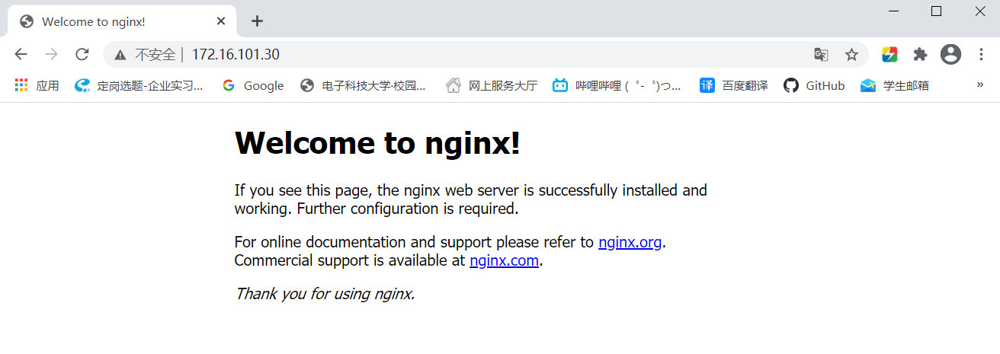
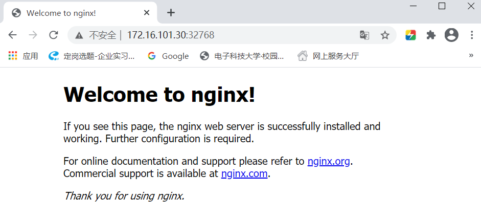

# 运行你的第一个docker

作者：杨进豪         邮箱：jinhao.yang@smartmore.com

**使用命令： docker run**

### 名词介绍

镜像：Docker镜像里包含了你打包的应用程序及其所依赖的环境。 它包含应用程序需要的所有的依赖，乃至操作系统的文件系统。**可以简单理解为游戏存档，它包含玩家的游戏数据，还包含游戏本身的部分数据** 

容器：使用docker run 命令将一个镜像运行起来的实例，**类似于运行起来的游戏存档，同样的存档可以同时在不同的电脑上运行起来，就形成了同一个镜像对应多个容器**

### 语法

docker run  [OPTIONS]  image  [COMMAND]   [ARG...]

### 实例

1. ##### 启动一个镜像，并在其中执行/bin/bash 命令

   命令： **docker run -it nginx:latest /bin/bash**

   命令行反馈：

   ```bash
   yjh@yjh-Vostro-5880:~$ docker run -it nginx:latest /bin/bash
   root@0d8e9ab823e3:/# ls
   bin     docker-entrypoint.d   home   media  proc	sbin  tmp
   boot    docker-entrypoint.sh  lib    mn     root	srv   usr
   dev     etc		              lib64  opt	run	    sys   var
   ```

   效果：成功运行nginx镜像，并进入bash

   什么是-it：-it是-i(--interactive，以交互模式运行容器)， -t(--tty，为容器重新分配一个伪输入终端)合并起来的简写，配合末尾的/bin/bash便可以获取到容器的命令行。如果希望像平常一样使用shell，需要同时使用这两个选项(如果缺少第一个选项就无法输入任何命令。如果缺少第二个选项,那么命令提示符不会显示,并且 一些命令会提示TERM变量没有设置)

   

   什么时候需要用到-it：

   - 测试，进入容器查看文件、程序是否已经被复制进或挂载到容器中
   - 检查镜像是否满足使用条件，进入容器检查需要的组件是否已经存在
   - 其它需要使用到容器终端的情况

   

   特殊情况：**部分镜像中可能不存在bash，需要将/bin/bash换成/bin/sh**

   ```bash
   yjh@yjh-Vostro-5880:~$ docker run -it alpine:latest /bin/bash
   docker: Error response from daemon: OCI runtime create failed: container_linux.go:370: starting container process caused: exec: "/bin/bash": stat /bin/bash: no such file or directory: unknown.
   ERRO[0002] error waiting for container: context canceled 
   yjh@yjh-Vostro-5880:~$ docker run -it alpine:latest /bin/sh
   / # 
   / # exit
   yjh@yjh-Vostro-5880:~$ 
   ```

   如何退出docker容器的命令行：输入**exit**或者**Ctrl+d**

   

2. ##### 启动一个镜像，并将其80端口映射到主机的80端口

   命令：**docker run -p 80:80 -d nginx:latest**

   命令行反馈：

   ```bash
   yjh@yjh-Vostro-5880:~$ docker run -p 80:80 -d nginx:latest
   aba6eb2ddd4dc7bbfb541bf2fc52c75bfa9a89842c608236ef1d8834fdb69446
   ```

   其中返回的aba6eb...是容器的id

   

   效果：通过访问主机的80端口能访问到nginx服务

   
   
   什么是-p：将容器的 80 端口映射到主机的 80 端口。**默认都是tcp，如果是udp则需要在最后添加/udp(-p 80:80/udp)**
   
   什么是-d：Detached，后台运行，相当于命令行中写&，当使用-d分离容器之后，容器也会继续运行。因此**-d 与 -it同时使用会导致-it不生效**
   
   ```bash
   yjh@yjh-Vostro-5880:~$ docker run -it -d alpine:latest /bin/sh
   7b55a4b3317d37b65aa447cd7c93a6685009d2a06980e3574896106eb44e3841
   yjh@yjh-Vostro-5880:~$ docker ps -a
CONTAINER ID   IMAGE           COMMAND                  CREATED             STATUS      
   7b55a4b3317d   alpine:latest   "/bin/sh"                2 seconds ago       Up 1 second  
   ```
   
   
   
   什么时候需要用到-p：容器中运行的程序需要能被访问时，需要将容器中的端口通过-p映射出来，否则将会无法成功访问。-p除了暴露指定主机端口以外，还可以**不指定主机端口，随机分配一个未使用的端口进行暴露**
   
   ```bash
   yjh@yjh-Vostro-5880:~$ docker run -p 80 -d nginx:latest
   452af484f3edbddee9560ff3dcbff7cca990633da03858ba490603990ce1abc4
   yjh@yjh-Vostro-5880:~$ docker ps -a
   CONTAINER ID   IMAGE          COMMAND                  CREATED         STATUS         PORTS                   ...
   452af484f3ed   nginx:latest   "/docker-entrypoint.…"   4 seconds ago   Up 2 seconds   0.0.0.0:32768->80/tcp   ...  
   ```
   
   通过访问主机:32768便可以成功访问到nginx服务
   
   
   
   什么时候需要使用-d：
   
   - 容器之中运行的是一个会一直运行的服务
   - 不需要与容器有命令行交互
   
   
   
3. **启动一个镜像，在容器退出时自动删除容器**

   命令：**docker run --rm nginx:latest**

   ```bash
   //命令行1
   yjh@yjh-Vostro-5880:~$ docker run --rm -v /home/yjh/hello:/hello  nginx:latest
   ......
   /docker-entrypoint.sh: Launching /docker-entrypoint.d/20-envsubst-on-templates.sh
   /docker-entrypoint.sh: Configuration complete; ready for start up
   //Ctrl+c退出容器
   ```

   ```bash
   //命令行2
   yjh@yjh-Vostro-5880:~$ docker ps -a
   CONTAINER ID   IMAGE          COMMAND                  CREATED          STATUS                     ...
   7a73d0f8af05   nginx:latest   "/docker-entrypoint.…"   5 seconds ago    Up 4 seconds               ...  
   a57e54dde5e8   nginx:latest   "/docker-entrypoint.…"   16 minutes ago   Exited (0) 14 minutes ago  ... 
   yjh@yjh-Vostro-5880:~$ docker ps -a
   CONTAINER ID   IMAGE          COMMAND                  CREATED          STATUS                     ...
   a57e54dde5e8   nginx:latest   "/docker-entrypoint.…"   16 minutes ago   Exited (0) 14 minutes ago  ...
   ```

   命令使用顺序：**命令行1.docker run --rm --> 命令行2.docker ps -a  -->命令行1. Ctrl+c  --> 命令行2.docker ps -a**

   效果：容器运行起来后，在新的命令行使用docker ps -a，能找到刚刚运行起来的容器的信息。**使用ctrl+c退出容器之后，docker会自动删除容器的信息**，使用docker ps -a会发现对应容器信息已消失 。而不使用--rm运行的容器则不会被自动删除。

   

   什么是--rm：在Docker容器退出时，默认容器内部的文件系统仍然被保留，以方便调试并保留用户数据，使用docker ps -a能看到之前的容器信息存在但容器状态为已退出。但是对于部分容器，由于其只是在开发调试过程中临时使用，其用户数据并无保留的必要，因而可以在容器启动时设置--rm选项，这样在容器退出时就能够自动清理容器内部的文件系统

   

   注意事项：--rm不能与-d同时使用，此时**--rm失效**

   ```bash
   yjh@yjh-Vostro-5880:~$ docker run --rm -d nginx:latest
   34165978f5fd446db4b5a91a6ece2eee48b7bdaebf89d12fc54525119b843b68
   yjh@yjh-Vostro-5880:~$ docker ps -a
   CONTAINER ID   IMAGE          COMMAND                  CREATED          STATUS                      ...
   34165978f5fd   nginx:latest   "/docker-entrypoint.…"   14 seconds ago   Up 12 seconds               ...
   a57e54dde5e8   nginx:latest   "/docker-entrypoint.…"   33 minutes ago   Exited (0) 32 minutes ago   ...
   ```

   
